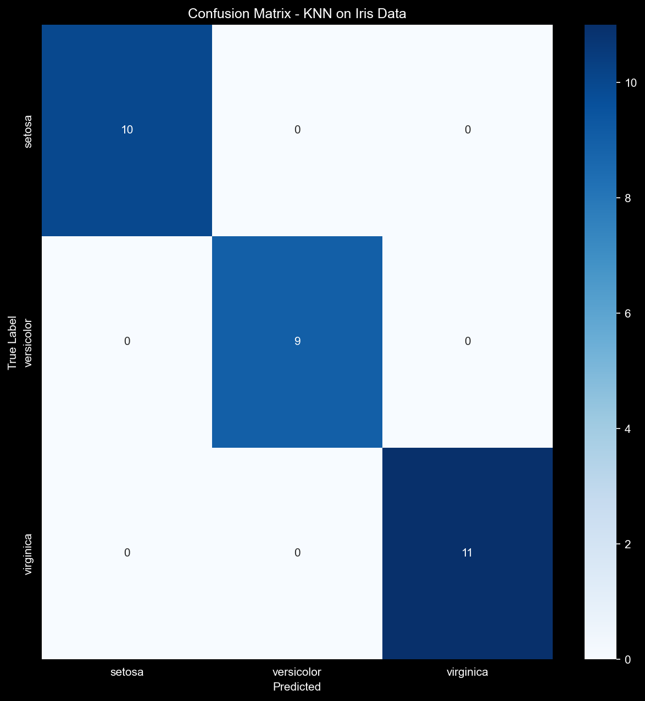
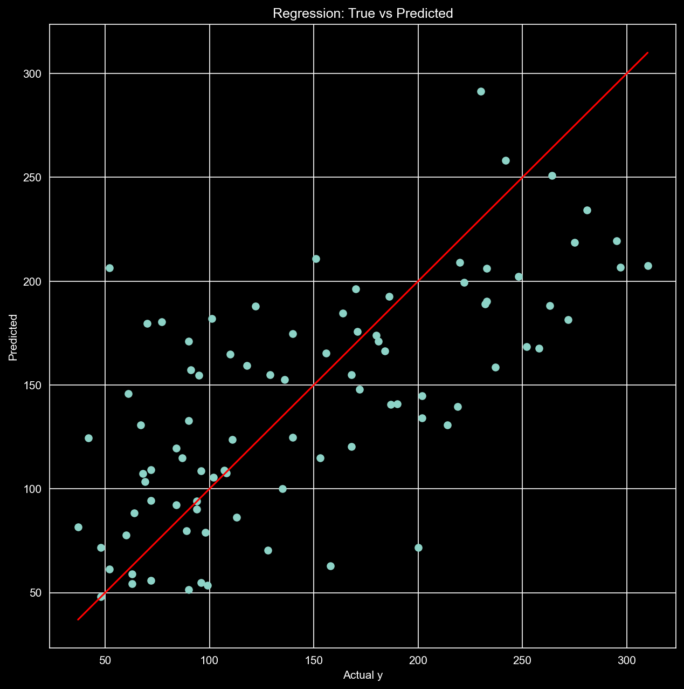
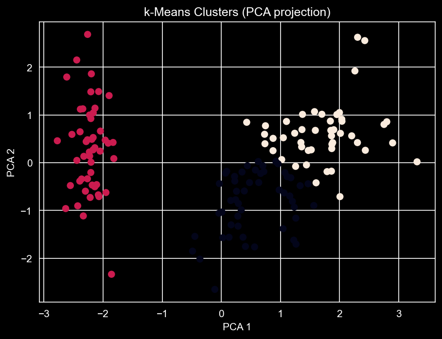

# ML Foundations Project (scikit-learn)

Dieses Projekt zeigt eine komplette Machine-Learning-Grundlagen-Pipeline mit Python:
- **Klassifikation (Supervised Learning)**: KNN auf dem Iris-Datensatz
- **Regression (Supervised Learning)**: lineare/robuste Regression + Metriken
- **Clustering (Unsupervised Learning)**: k-Means + Silhouette Score (optional PCA-Plot)

## Ziele
- Daten als **X (Features)** und **y (Labels)** korrekt verstehen
- Sauberen Workflow: **Train/Test Split → Train → Predict → Evaluate**
- Wichtige Metriken sicher anwenden:
  - Klassifikation: Accuracy, Precision, Recall, F1, Confusion Matrix
  - Regression: MSE, R²
  - Clustering: Silhouette Score


---

## 📂 Projektstruktur

```text
ml-foundations-project/
│
├── requirements.txt
├── README.md
├── notebooks/
│   ├── 01_classification_knn.ipynb
│   ├── 02_regression.ipynb
│   ├── 03_clustering_kmeans.ipynb
│   └── plots/
│       ├── knn_confusion_matrix.png
│       ├── regression_true_vs_pred.png
│       └── kmeans_pca_clusters.png
└── data/
```

## 🔍 Inhalte

### 1️⃣ Klassifikation – KNN (Iris Dataset)
- Train/Test Split
- K-Nearest Neighbors (KNN)
- Evaluation:
  - Accuracy
  - Precision / Recall / F1-Score
  - Confusion Matrix

📊 **Ergebnis (Beispiel):**
- Hohe Accuracy
- Sehr gute Trennung der Klasse *Setosa*
- Leichte Verwechslungen zwischen *Versicolor* und *Virginica*

📷 *Confusion Matrix Plot:*


---

### 2️⃣ Regression – Lineare Regression (Diabetes Dataset)
- Lineare Regression
- Evaluation:
  - Mean Squared Error (MSE)
  - R² Score
- Visualisierung: True vs. Predicted

📊 **Ergebnis (Beispiel):**
- MSE zeigt moderate Abweichung
- Positiver R² → Modell erklärt einen Teil der Varianz

📷 *True vs Predicted Plot:*


---

### 3️⃣ Clustering – k-Means (Iris, ohne Labels)
- Feature Scaling (StandardScaler)
- k-Means Clustering
- Silhouette Score zur Bewertung
- PCA-Visualisierung (2D)

📊 **Ergebnis (Beispiel):**
- Silhouette Score zeigt sinnvolle Clusterstruktur
- Ein Cluster entspricht fast vollständig *Setosa*

📷 *k-Means PCA Plot:*
